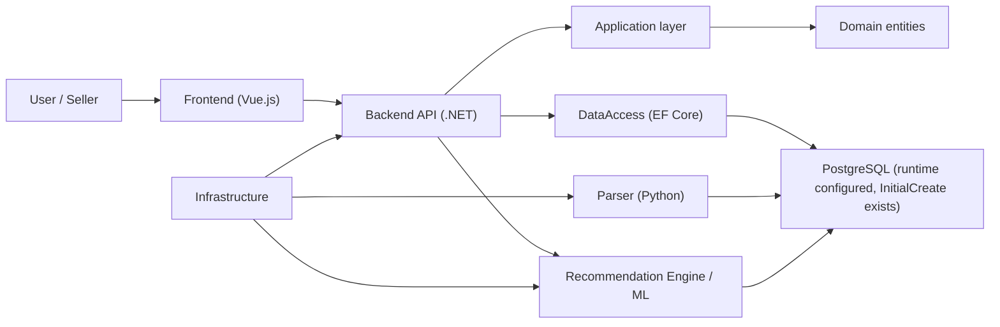
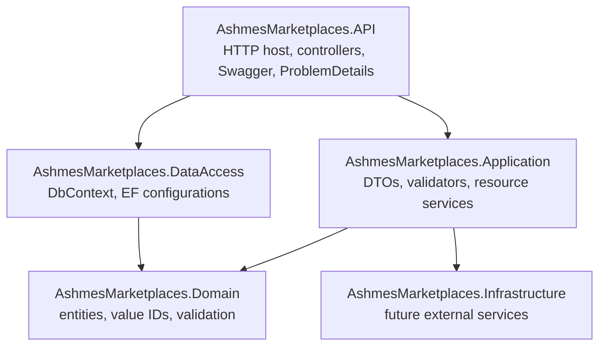
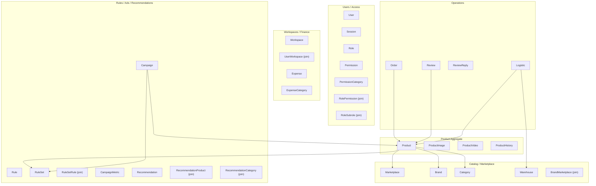

# AshmesMarketplaces Architecture

## Table of Contents

- [Purpose](#purpose)
- [High-Level Architecture](#high-level-architecture)
- [Project Structure](#project-structure)
- [Backend Solution](#backend-solution)
- [Backend Layers](#backend-layers)
- [Domain Model Status](#domain-model-status)
- [EF Core and PostgreSQL Approach](#ef-core-and-postgresql-approach)
- [Product Aggregate](#product-aggregate)
- [Join Entities](#join-entities)
- [JSONB Usage](#jsonb-usage)
- [Scaling Principles](#scaling-principles)
- [Implemented vs Not Implemented](#implemented-vs-not-implemented)

## Purpose

AshmesMarketplaces is intended to be an analytics and sales-management platform for marketplace sellers. The system is being shaped around:

- product-card management;
- marketplace analytics;
- order, review, stock, logistics, and advertising data;
- workspace-based team collaboration;
- recommendations and ML-generated insights;
- parser-driven data collection from marketplaces such as Wildberries.

The current production-grade implementation work is concentrated in the .NET backend entity layer, EF Core mapping layer, PostgreSQL runtime setup, first migration, and reviewed API/Application CRUD vertical slices for Catalog, Product, and Operations resources. Frontend integration, parser integration, ML runtime integration, and auth are not implemented yet.

## High-Level Architecture



### Subsystems

| Subsystem | Current state | Intended responsibility |
|---|---:|---|
| Backend (.NET) | Active | API host, domain model, EF Core mappings, future application services |
| Frontend (Vue.js) | Folder exists, no inspected implementation | Seller-facing UI |
| Parser (Python) | Existing parser scripts | Marketplace data collection, token/cookie handling, category/search parsing |
| Recommendation Engine / ML | Folder exists, no inspected implementation | Recommendation generation and model-based analysis |
| Analytics | Represented in DB model | Analytical reporting over products, orders, reviews, logistics, campaigns |
| Infrastructure | .NET project exists, currently empty/minimal | Future external integrations, file storage, messaging, observability |

## Project Structure

Repository root:

```text
E:\AshmesMarketplaces
├── Backend
├── Frontend
├── Parser
├── Intelligence
├── Documents
└── docs
```

Notes:

- `Documents/` contains project documentation and screenshots. It is ignored by git.
- `docs/` is local architecture context for AI sessions. At the time of creation it is also locally excluded from git tracking via `.git/info/exclude`.
- `Parser/` contains Python scripts such as `SearchPhraseParser.py`, `CategoriesParser.py`, `get_token.py`, and result/download folders.
- `Frontend/` and `Intelligence/` exist as top-level folders but were not modified during backend entity work.

## Backend Solution

Solution: `Backend/AshmesMarketplaces.sln`

Projects:

| Project | Target | Current role |
|---|---|---|
| `AshmesMarketplaces.API` | `net10.0` | ASP.NET Core app with DbContext registration, controllers, Swagger, ProblemDetails, validation filter |
| `AshmesMarketplaces.Application` | `net10.0` | DTOs, shared pagination/result models, validators, and resource services |
| `AshmesMarketplaces.Domain` | `net10.0` | Entities, IDs, shared errors/constants, UTC DateTime guard |
| `AshmesMarketplaces.DataAccess` | `net10.0` | `ApplicationDbContext`, EF Core configurations, Npgsql setup, design-time factory |
| `AshmesMarketplaces.Infrastructure` | `net10.0` | Placeholder for infrastructure integrations |

Current notable packages:

- `AshmesMarketplaces.Domain`: `CSharpFunctionalExtensions`.
- `AshmesMarketplaces.DataAccess`: `Microsoft.EntityFrameworkCore`, `Microsoft.EntityFrameworkCore.Relational`, `Microsoft.EntityFrameworkCore.Design`, `Npgsql.EntityFrameworkCore.PostgreSQL`.
- `AshmesMarketplaces.Application`: `FluentValidation`, project reference to DataAccess.
- `AshmesMarketplaces.API`: `Microsoft.EntityFrameworkCore.Design`, `FluentValidation.DependencyInjectionExtensions`, `Swashbuckle.AspNetCore`, project references to DataAccess and Application.
- Local EF tooling: `.config/dotnet-tools.json` with `dotnet-ef`.

## Backend Layers



### Domain

The Domain project currently contains:

- `BaseEntity<TId>`;
- `ProductId` readonly value object;
- shared `Error`, `Errors`, `Constants`;
- `DateTimeUtc` guard for persisted UTC-only `DateTime` values;
- entity classes grouped by subsystem.

Entities use:

- private EF constructors;
- private setters;
- public constructors/factories with obvious validation;
- comments beside int enum placeholders when documentation says `enum` but values are unknown.
- UTC validation for persisted `DateTime` constructor arguments.

### DataAccess

The DataAccess project contains:

- `ApplicationDbContext : DbContext`;
- `ApplicationDbContextFactory : IDesignTimeDbContextFactory<ApplicationDbContext>`;
- `DbSet<>` for each implemented entity;
- one `IEntityTypeConfiguration<T>` per entity;
- `ApplyConfigurationsFromAssembly(typeof(ApplicationDbContext).Assembly)`.
- Npgsql provider package and migration assembly setup.

### API

The API project currently contains PostgreSQL DbContext registration, controller registration, application service registration, ProblemDetails, Development-only Swagger, and FluentValidation action filtering:

```csharp
var builder = WebApplication.CreateBuilder(args);
builder.Services.AddDatabase(builder.Configuration);
builder.Services.AddApplicationServices();
builder.Services.AddApiProblemDetails();
builder.Services.AddSwaggerDocumentation();
builder.Services.AddControllers(...);
var app = builder.Build();
app.UseExceptionHandler();
app.UseSwaggerDocumentation();
app.MapControllers();
app.Run();
```

Implemented API surface currently includes reviewed CRUD vertical slices:

```text
GET    /api/v1/marketplaces
GET    /api/v1/marketplaces/{id}
POST   /api/v1/marketplaces
PUT    /api/v1/marketplaces/{id}
DELETE /api/v1/marketplaces/{id}

GET    /api/v1/brands
GET    /api/v1/brands/{id}
POST   /api/v1/brands
PUT    /api/v1/brands/{id}
DELETE /api/v1/brands/{id}

GET    /api/v1/categories
GET    /api/v1/categories/{id}
POST   /api/v1/categories
PUT    /api/v1/categories/{id}
DELETE /api/v1/categories/{id}

GET    /api/v1/warehouses
GET    /api/v1/warehouses/{id}
POST   /api/v1/warehouses
PUT    /api/v1/warehouses/{id}
DELETE /api/v1/warehouses/{id}

GET    /api/v1/products
GET    /api/v1/products/{id}
POST   /api/v1/products
PUT    /api/v1/products/{id}
DELETE /api/v1/products/{id}
GET    /api/v1/products/{id}/history

GET    /api/v1/orders
GET    /api/v1/orders/{id}
POST   /api/v1/orders
PUT    /api/v1/orders/{id}
DELETE /api/v1/orders/{id}

GET    /api/v1/reviews
GET    /api/v1/reviews/{id}
POST   /api/v1/reviews
PUT    /api/v1/reviews/{id}
DELETE /api/v1/reviews/{id}

GET    /api/v1/review-replies
GET    /api/v1/review-replies/{id}
POST   /api/v1/review-replies
PUT    /api/v1/review-replies/{id}
DELETE /api/v1/review-replies/{id}

GET    /api/v1/logistics
GET    /api/v1/logistics/{id}
POST   /api/v1/logistics
PUT    /api/v1/logistics/{id}
DELETE /api/v1/logistics/{id}
```

Auth/JWT/workspace authorization are not implemented yet.

### API/Application CRUD Pattern

Current CRUD pattern:

- one controller per public resource group;
- one resource service per entity/resource, for example `IMarketplaceService`;
- direct `ApplicationDbContext` access from Application services;
- no repository/unit-of-work wrapper over EF Core;
- no CQRS/handler-per-operation for simple CRUD;
- no generic CRUD controller/service abstraction;
- manual mapping between entities and DTOs;
- FluentValidation for request DTOs;
- `ProblemDetails` for errors;
- `PagedResponse<T>` plus `ListQuery` for list endpoints.
- resource-specific query DTOs are allowed for broader filters, for example `ProductListQuery`, `OrderListQuery`, `ReviewListQuery`, and `LogisticListQuery`;
- `ProductId` is exposed as `Guid` at the API boundary and converted to/from `ProductId` inside Application services;
- `ProductHistory` is read-only in the first Product API stage.

## Domain Model Status



## EF Core and PostgreSQL Approach

The backend is prepared for PostgreSQL runtime usage, and the first migration has been created.

Current approach:

- EF Core Fluent API is the source of truth for persistence mapping.
- PostgreSQL provider is `Npgsql.EntityFrameworkCore.PostgreSQL`.
- API registers `ApplicationDbContext` from `ConnectionStrings:Postgres`.
- DataAccess provides a design-time DbContext factory for EF tooling.
- Table names follow the ER/project documentation names, for example `Products`, `ProductImages`, `Users_Workspaces`.
- Column names are explicit `snake_case`.
- Composite keys are configured for join entities.
- Money values use `decimal` and EF `HasPrecision(18, 2)`.
- Scores use `decimal` with higher precision where appropriate.
- JSON fields use `JsonDocument?` and `jsonb`.
- Persisted `DateTime` values are UTC-only for PostgreSQL `timestamptz`.
- Guid and `ProductId` primary keys are application-generated with `.ValueGeneratedNever()`; `Session.Id` remains integer identity.
- No unique indexes are added unless documented.
- Delete behavior is explicit per relationship.

## Product Aggregate

Implemented product aggregate:

- `Product` aggregate root.
- `ProductImage` and `ProductVideo` are separate tables, not JSON arrays and not EF owned collections.
- `ProductHistory` tracks historical price/cost/discount/activity state.
- `Product.Id` uses `ProductId`.
- `SkuSeller`, `SkuProduct`, and external marketplace IDs are strings.
- `Characteristics` is `JsonDocument?` mapped to `jsonb`.

Main relationships:

- `Product -> Marketplace` required.
- `Product -> Brand` optional.
- `Product -> Category` optional.
- `Product -> RuleSet` optional through `IdSetPrice`.
- `Product -> Workspace` optional.
- `Product -> User` optional.
- `Product -> ProductImage/ProductVideo` cascading child records.
- `Product -> ProductHistory` and analytical records restrict deletion.

## Join Entities

Join entities are explicit classes, not hidden EF many-to-many skip navigations:

| Entity | Table | Composite key |
|---|---|---|
| `BrandMarketplace` | `Brands_Marketplaces` | `id_mp`, `id_brand` |
| `RolePermission` | `Roles_Permissions` | `id_role`, `id_permission` |
| `RoleSubrole` | `Role_Subroles` | `id_role`, `id_subrole` |
| `RuleSetRule` | `Sets_Rules` | `id_set`, `id_rule` |
| `UserWorkspace` | `Users_Workspaces` | `id_user`, `id_workspace` |
| `RecommendationProduct` | `Recommendation_Products` | `id_recommendation`, `id_product` |
| `RecommendationCategory` | `Recommendation_Categories` | `id_recommendation`, `id_category` |

## JSONB Usage

Implemented JSONB fields:

| Entity | Property | Column | CLR type |
|---|---|---|---|
| `Product` | `Characteristics` | `characteristics` | `JsonDocument?` |
| `Campaign` | `TimeToImpression` | `time_to_impression` | `JsonDocument?` |
| `Recommendation` | `Explanation` | `explanation` | `JsonDocument?` |
| `Recommendation` | `Snapshot` | `snapshot` | `JsonDocument?` |

Rationale:

- These structures are dynamic and marketplace/model dependent.
- `JsonDocument?` is safer than storing JSON as plain `string`.
- Strong value objects should be introduced later only when schemas stabilize.

## Scaling Principles

- Keep entity changes incremental by subsystem.
- Add migrations only after the model is intentionally reviewed.
- Keep join entities explicit to allow metadata later.
- Keep API DTOs separate from entities.
- Keep persistence rules in EF configurations.
- PostgreSQL provider and connection registration exist; do not auto-apply migrations on app startup.
- Keep build clean: `0 warnings`, `0 errors`.

## Implemented vs Not Implemented

Implemented:

- Domain entities for catalog, access, product aggregate, operations, workspace/finance, advertising, recommendations.
- EF Core configurations for implemented entities.
- `ApplicationDbContext` with DbSets.
- PostgreSQL provider package and API DbContext registration.
- Design-time DbContext factory.
- `InitialCreate` EF Core migration.
- API/Application foundation for CRUD.
- Catalog CRUD endpoints, DTOs, validators, and services:
  - `Marketplaces`;
  - `Brands`;
  - `Categories`;
  - `Warehouses`.
- Product API stage 1:
  - `Products` CRUD;
  - Product detail with characteristics JSON and media DTOs;
  - read-only product history list.
- Operations CRUD endpoints, DTOs, validators, and services:
  - `Orders`;
  - `Reviews`;
  - `ReviewReplies`;
  - `Logistics`.
- Local Docker Compose infrastructure for PostgreSQL, pgAdmin, Redis, and MinIO.
- Local `dotnet-ef` tool manifest.
- Local git ignore for `Documents/`.

Not implemented:

- Authentication/authorization middleware.
- Repository/unit-of-work abstractions.
- CRUD endpoints for access, workspaces/finance, advertising, recommendations, and join resources not yet exposed explicitly.
- Standalone product media mutation endpoints.
- Parser-to-backend integration.
- ML service integration.
- Frontend integration.
- Production Docker/deployment configuration for the backend.
