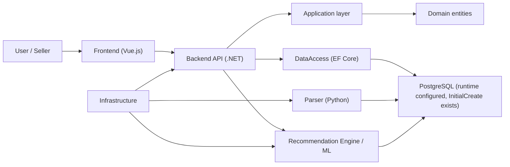
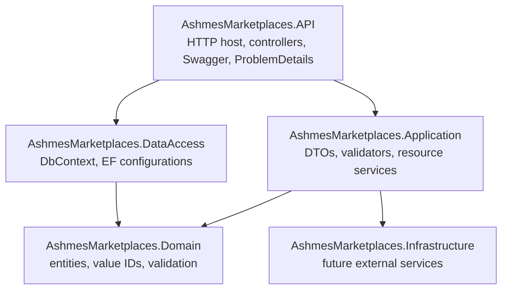
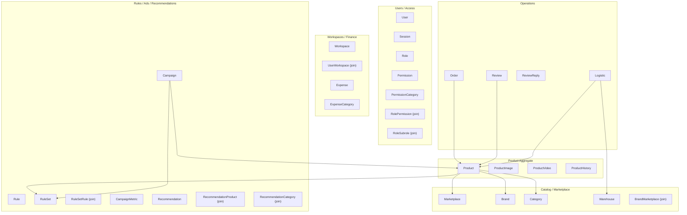

# AshmesMarketplaces Architecture

## Table of Contents

- [Purpose](#purpose)
- [High-Level Architecture](#high-level-architecture)
- [Project Structure](#project-structure)
- [Backend Solution](#backend-solution)
- [Backend Layers](#backend-layers)
- [Domain Model Status](#domain-model-status)
- [EF Core and PostgreSQL Approach](#ef-core-and-postgresql-approach)
- [Product Aggregate](#product-aggregate)
- [Join Entities](#join-entities)
- [JSONB Usage](#jsonb-usage)
- [Scaling Principles](#scaling-principles)
- [Implemented vs Not Implemented](#implemented-vs-not-implemented)

## Purpose

AshmesMarketplaces is intended to be an analytics and sales-management platform for marketplace sellers. The system is being shaped around:

- product-card management;
- marketplace analytics;
- order, review, stock, logistics, and advertising data;
- workspace-based team collaboration;
- recommendations and ML-generated insights;
- parser-driven data collection from marketplaces such as Wildberries.

The current production-grade implementation includes the .NET backend entity layer, EF Core mapping layer, PostgreSQL runtime setup, first migration, completed API/Application CRUD coverage for Catalog, Product, Operations, Advertising, Finance, Users/Workspaces, Access, Rules, and Recommendations resources, implemented Auth/Security Foundation, implemented Development Seed Foundation, implemented Frontend Foundation v2, completed frontend visual redesign stage 1, completed Products Polish Stage 1, local dev startup scripts, and hardened frontend theme tokens. Parser integration and ML runtime integration are not implemented yet.

## High-Level Architecture



### Subsystems

| Subsystem | Current state | Intended responsibility |
|---|---:|---|
| Backend (.NET) | Foundation implemented | API host, domain model, EF Core mappings, CRUD APIs, Auth/Security Foundation, Development Seed |
| Frontend (Vue.js) | Foundation implemented and Products page polished | Seller-facing UI, auth flow, protected shell, Products vertical slice, dark marketplace intelligence visual system |
| Parser (Python) | Existing parser scripts | Marketplace data collection, token/cookie handling, category/search parsing |
| Recommendation Engine / ML | Folder exists, no inspected implementation | Recommendation generation and model-based analysis |
| Analytics | Represented in DB model | Analytical reporting over products, orders, reviews, logistics, campaigns |
| Infrastructure | .NET project exists, currently empty/minimal | Future external integrations, file storage, messaging, observability |

## Project Structure

Repository root:

```text
E:\AshmesMarketplaces
├── Backend
├── Frontend
├── Parser
├── Intelligence
├── Documents
└── docs
```

Notes:

- `Documents/` contains project documentation and screenshots. It is ignored by git.
- `docs/` is local architecture context for AI sessions. At the time of creation it is also locally excluded from git tracking via `.git/info/exclude`.
- `Parser/` contains Python scripts such as `SearchPhraseParser.py`, `CategoriesParser.py`, `get_token.py`, and result/download folders.
- `Frontend/` contains the implemented Vue 3 + TypeScript + Vite foundation with feature-oriented structure.
- `Intelligence/` exists as a top-level folder but no ML runtime integration has been implemented.
- `scripts/dev/` contains local startup/shutdown scripts for PostgreSQL + pgAdmin, backend API, and frontend Vite.
- `.dev/` is a git-ignored runtime folder for local logs and PID files created by the dev scripts.

## Backend Solution

Solution: `Backend/AshmesMarketplaces.sln`

Projects:

| Project | Target | Current role |
|---|---|---|
| `AshmesMarketplaces.API` | `net10.0` | ASP.NET Core app with DbContext registration, controllers, Swagger, ProblemDetails, validation filter, JWT Bearer auth, Development Seed |
| `AshmesMarketplaces.Application` | `net10.0` | DTOs, shared pagination/result models, validators, resource services, auth services |
| `AshmesMarketplaces.Domain` | `net10.0` | Entities, IDs, shared errors/constants, UTC DateTime guard |
| `AshmesMarketplaces.DataAccess` | `net10.0` | `ApplicationDbContext`, EF Core configurations, Npgsql setup, design-time factory |
| `AshmesMarketplaces.Infrastructure` | `net10.0` | Placeholder for infrastructure integrations |

Current notable packages:

- `AshmesMarketplaces.Domain`: `CSharpFunctionalExtensions`.
- `AshmesMarketplaces.DataAccess`: `Microsoft.EntityFrameworkCore`, `Microsoft.EntityFrameworkCore.Relational`, `Microsoft.EntityFrameworkCore.Design`, `Npgsql.EntityFrameworkCore.PostgreSQL`.
- `AshmesMarketplaces.Application`: `FluentValidation`, `Microsoft.Extensions.Identity.Core`, `System.IdentityModel.Tokens.Jwt`, project reference to DataAccess.
- `AshmesMarketplaces.API`: `Microsoft.AspNetCore.Authentication.JwtBearer`, `Microsoft.EntityFrameworkCore.Design`, `FluentValidation.DependencyInjectionExtensions`, `Swashbuckle.AspNetCore`, project references to DataAccess and Application.
- Local EF tooling: `.config/dotnet-tools.json` with `dotnet-ef`.

## Backend Layers



### Domain

The Domain project currently contains:

- `BaseEntity<TId>`;
- `ProductId` readonly value object;
- shared `Error`, `Errors`, `Constants`;
- `DateTimeUtc` guard for persisted UTC-only `DateTime` values;
- entity classes grouped by subsystem.

Entities use:

- private EF constructors;
- private setters;
- public constructors/factories with obvious validation;
- comments beside int enum placeholders when documentation says `enum` but values are unknown.
- UTC validation for persisted `DateTime` constructor arguments.

### DataAccess

The DataAccess project contains:

- `ApplicationDbContext : DbContext`;
- `ApplicationDbContextFactory : IDesignTimeDbContextFactory<ApplicationDbContext>`;
- `DbSet<>` for each implemented entity;
- one `IEntityTypeConfiguration<T>` per entity;
- `ApplyConfigurationsFromAssembly(typeof(ApplicationDbContext).Assembly)`.
- Npgsql provider package and migration assembly setup.

### API

The API project currently contains PostgreSQL DbContext registration, controller registration, application service registration, ProblemDetails, Development-only Swagger with Bearer auth support, JWT Bearer authentication, authorization middleware, and FluentValidation action filtering:

```csharp
var builder = WebApplication.CreateBuilder(args);
builder.Services.AddDatabase(builder.Configuration);
builder.Services.AddApplicationServices();
builder.Services.AddApiProblemDetails();
builder.Services.AddAuthSecurity(builder.Configuration);
builder.Services.AddSwaggerDocumentation();
builder.Services.AddControllers(...);
var app = builder.Build();
await app.SeedDevelopmentDataAsync();
app.UseExceptionHandler();
app.UseSwaggerDocumentation();
app.UseAuthentication();
app.UseAuthorization();
app.MapControllers();
app.Run();
```

Implemented API surface currently includes reviewed CRUD vertical slices:

```text
GET    /api/v1/marketplaces
GET    /api/v1/marketplaces/{id}
POST   /api/v1/marketplaces
PUT    /api/v1/marketplaces/{id}
DELETE /api/v1/marketplaces/{id}

GET    /api/v1/brands
GET    /api/v1/brands/{id}
POST   /api/v1/brands
PUT    /api/v1/brands/{id}
DELETE /api/v1/brands/{id}

GET    /api/v1/categories
GET    /api/v1/categories/{id}
POST   /api/v1/categories
PUT    /api/v1/categories/{id}
DELETE /api/v1/categories/{id}

GET    /api/v1/warehouses
GET    /api/v1/warehouses/{id}
POST   /api/v1/warehouses
PUT    /api/v1/warehouses/{id}
DELETE /api/v1/warehouses/{id}

GET    /api/v1/products
GET    /api/v1/products/{id}
POST   /api/v1/products
PUT    /api/v1/products/{id}
DELETE /api/v1/products/{id}
GET    /api/v1/products/{id}/history

GET    /api/v1/orders
GET    /api/v1/orders/{id}
POST   /api/v1/orders
PUT    /api/v1/orders/{id}
DELETE /api/v1/orders/{id}

GET    /api/v1/reviews
GET    /api/v1/reviews/{id}
POST   /api/v1/reviews
PUT    /api/v1/reviews/{id}
DELETE /api/v1/reviews/{id}

GET    /api/v1/review-replies
GET    /api/v1/review-replies/{id}
POST   /api/v1/review-replies
PUT    /api/v1/review-replies/{id}
DELETE /api/v1/review-replies/{id}

GET    /api/v1/logistics
GET    /api/v1/logistics/{id}
POST   /api/v1/logistics
PUT    /api/v1/logistics/{id}
DELETE /api/v1/logistics/{id}

GET    /api/v1/campaigns
GET    /api/v1/campaigns/{id}
POST   /api/v1/campaigns
PUT    /api/v1/campaigns/{id}
DELETE /api/v1/campaigns/{id}

GET    /api/v1/campaign-metrics
GET    /api/v1/campaign-metrics/{id}
POST   /api/v1/campaign-metrics
PUT    /api/v1/campaign-metrics/{id}
DELETE /api/v1/campaign-metrics/{id}

GET    /api/v1/expense-categories
GET    /api/v1/expense-categories/{id}
POST   /api/v1/expense-categories
PUT    /api/v1/expense-categories/{id}
DELETE /api/v1/expense-categories/{id}

GET    /api/v1/expenses
GET    /api/v1/expenses/{id}
POST   /api/v1/expenses
PUT    /api/v1/expenses/{id}
DELETE /api/v1/expenses/{id}

GET    /api/v1/users
GET    /api/v1/users/{id}
POST   /api/v1/users
PUT    /api/v1/users/{id}
DELETE /api/v1/users/{id}

GET    /api/v1/workspaces
GET    /api/v1/workspaces/{id}
POST   /api/v1/workspaces
PUT    /api/v1/workspaces/{id}
DELETE /api/v1/workspaces/{id}

GET    /api/v1/user-workspaces
GET    /api/v1/user-workspaces/{idUser}/{idWorkspace}
POST   /api/v1/user-workspaces
PUT    /api/v1/user-workspaces/{idUser}/{idWorkspace}
DELETE /api/v1/user-workspaces/{idUser}/{idWorkspace}

GET    /api/v1/roles
GET    /api/v1/roles/{id}
POST   /api/v1/roles
PUT    /api/v1/roles/{id}
DELETE /api/v1/roles/{id}

GET    /api/v1/permission-categories
GET    /api/v1/permission-categories/{id}
POST   /api/v1/permission-categories
PUT    /api/v1/permission-categories/{id}
DELETE /api/v1/permission-categories/{id}

GET    /api/v1/permissions
GET    /api/v1/permissions/{id}
POST   /api/v1/permissions
PUT    /api/v1/permissions/{id}
DELETE /api/v1/permissions/{id}

GET    /api/v1/role-permissions
GET    /api/v1/role-permissions/{idRole}/{idPermission}
POST   /api/v1/role-permissions
DELETE /api/v1/role-permissions/{idRole}/{idPermission}

GET    /api/v1/role-subroles
GET    /api/v1/role-subroles/{idRole}/{idSubrole}
POST   /api/v1/role-subroles
DELETE /api/v1/role-subroles/{idRole}/{idSubrole}

GET    /api/v1/rules
GET    /api/v1/rules/{id}
POST   /api/v1/rules
PUT    /api/v1/rules/{id}
DELETE /api/v1/rules/{id}

GET    /api/v1/rule-sets
GET    /api/v1/rule-sets/{id}
POST   /api/v1/rule-sets
PUT    /api/v1/rule-sets/{id}
DELETE /api/v1/rule-sets/{id}

GET    /api/v1/rule-set-rules
GET    /api/v1/rule-set-rules/{idSet}/{idRule}
POST   /api/v1/rule-set-rules
DELETE /api/v1/rule-set-rules/{idSet}/{idRule}

GET    /api/v1/recommendations
GET    /api/v1/recommendations/{id}
POST   /api/v1/recommendations
PUT    /api/v1/recommendations/{id}
DELETE /api/v1/recommendations/{id}

GET    /api/v1/recommendation-products
GET    /api/v1/recommendation-products/{idRecommendation}/{idProduct}
POST   /api/v1/recommendation-products
DELETE /api/v1/recommendation-products/{idRecommendation}/{idProduct}

GET    /api/v1/recommendation-categories
GET    /api/v1/recommendation-categories/{idRecommendation}/{idCategory}
POST   /api/v1/recommendation-categories
DELETE /api/v1/recommendation-categories/{idRecommendation}/{idCategory}

POST   /api/v1/auth/login
POST   /api/v1/auth/refresh
POST   /api/v1/auth/logout
GET    /api/v1/auth/me
```

Auth/Security Foundation is implemented. Authentication uses JWT access tokens plus opaque refresh tokens. `Sessions` is used for refresh/session storage and stores refresh-token hashes in `Sessions.token`. Existing CRUD APIs remain anonymous in the first auth stage for backward compatibility. Workspace authorization and full permission policy enforcement are not implemented yet.

Development Seed Foundation is implemented under `AshmesMarketplaces.API/DevelopmentSeed`. It runs only in Development when `Seed:EnableDevelopmentSeed=true`, creates local roles/accounts/workspace/catalog/products/demo analytical records, uses the existing password hashing service, and does not apply migrations.

### Frontend

Frontend Foundation v2 is implemented in `Frontend/` as a Vue 3 + TypeScript + Composition API application built with Vite. It uses Vue Router, Pinia, Axios, Tailwind CSS v4, and shared UI primitives backed by CSS tokens.

Frontend Visual Redesign Stage 1 is implemented. The current visual direction is a dark obsidian marketplace intelligence workstation with compact layouts, layered transparent panels, restrained ember accents, and dense Products table hierarchy. Fire/ember is a signal system only, not decorative flame imagery.

Theme token hardening is implemented:

- `Frontend/src/styles/tokens.css` is the theme source of truth.
- Semantic CSS variables are scoped through `:root, [data-theme="obsidian"]`.
- Shared primitives consume semantic variables for backgrounds, surfaces, borders, text, state colors, focus rings, shadows, ember accents, and heat states.
- No theme switcher UI exists yet.
- Future visual theme changes should primarily update tokens, not rewrite `Button`, `Input`, `Card`, `DataTable`, or shell components.

The frontend structure is feature-oriented:

```text
Frontend/src
├── app
├── entities
├── features
│   ├── auth
│   └── products
├── layouts
├── pages
├── shared
├── styles
└── widgets
```

Implemented frontend capabilities:

- persistent protected app shell with sidebar, topbar, content container, and page header;
- auth flow with login, logout, refresh retry, persisted MVP token storage, and protected routes;
- Products vertical slice with real backend integration, filters, sorting, pagination, URL query sync, KPI cards, loading/error/empty states;
- Products table visual polish with presentation-only heat signal scaffolding derived from current product fields such as status/update recency;
- Products Polish Stage 1:
  - compact filter toolbar with active chips, quick reset, native status select, and URL query sync;
  - dense Products table with corrected `ProductStatus` labels, row hover/focus/selection states, clickable and keyboard-openable rows, compact ID hierarchy, sticky header behavior, and signal mini bars;
  - read-only product detail drawer opened from a row, backed by existing `GET /api/v1/products/{id}` and showing media records, characteristics JSON, IDs, dates, status, and signal state;
  - heat tiers `dormant`, `warm`, `rising`, and `hot` derived only from existing `status` and `dateUpdated`.
- lightweight placeholders for Overview, Orders, Reviews, Logistics, Campaigns, Expenses, Recommendations, and Access settings.

The frontend is not a backend mirror. `entities` are used only for shared model types; feature behavior lives under `features/*`. Products heat indicators must not be described as real demand, growth, or recommendation metrics until real analytics fields/API contracts exist. Products detail in Stage 1 is read-only and does not add product create/update/delete/media mutation workflows.

### Local Development Workflow

Local dev startup scripts are implemented under `scripts/dev`:

```powershell
./scripts/dev/start-dev.ps1
./scripts/dev/stop-dev.ps1 -StopDocker
```

```bash
bash scripts/dev/start-dev.sh
bash scripts/dev/stop-dev.sh --docker
```

Default startup:

- starts PostgreSQL and pgAdmin from `docker-compose.local.yml`;
- starts backend API at `http://localhost:5019`;
- starts frontend Vite at `http://localhost:5173`;
- prints API, Swagger, Frontend, and pgAdmin URLs;
- writes logs/PIDs under `.dev/`;
- does not apply migrations automatically;
- does not enable development seed automatically;
- does not delete docker volumes.

### API/Application CRUD Pattern

Current CRUD pattern:

- one controller per public resource group;
- one resource service per entity/resource, for example `IMarketplaceService`;
- direct `ApplicationDbContext` access from Application services;
- no repository/unit-of-work wrapper over EF Core;
- no CQRS/handler-per-operation for simple CRUD;
- no generic CRUD controller/service abstraction;
- manual mapping between entities and DTOs;
- FluentValidation for request DTOs;
- `ProblemDetails` for errors;
- `PagedResponse<T>` plus `ListQuery` for list endpoints.
- resource-specific query DTOs are allowed for broader filters, for example `ProductListQuery`, `OrderListQuery`, `ReviewListQuery`, and `LogisticListQuery`;
- resource-specific query DTOs are used for broader filters in Product, Operations, Advertising, Finance, Users, Workspaces, and explicit join resources such as `UserWorkspaces`;
- `ProductId` is exposed as `Guid` at the API boundary and converted to/from `ProductId` inside Application services;
- `ProductHistory` is read-only in the first Product API stage.
- `User.Password` is accepted by create/update DTOs but is never returned by user response DTOs; create/update now stores password hashes using ASP.NET Core `PasswordHasher`.
- Auth uses dedicated DTOs/services under the Application auth slice; `AuthController` exposes login, refresh, logout, and current-user endpoints.

## Domain Model Status



## EF Core and PostgreSQL Approach

The backend is prepared for PostgreSQL runtime usage, and the first migration has been created.

Current approach:

- EF Core Fluent API is the source of truth for persistence mapping.
- PostgreSQL provider is `Npgsql.EntityFrameworkCore.PostgreSQL`.
- API registers `ApplicationDbContext` from `ConnectionStrings:Postgres`.
- DataAccess provides a design-time DbContext factory for EF tooling.
- Table names follow the ER/project documentation names, for example `Products`, `ProductImages`, `Users_Workspaces`.
- Column names are explicit `snake_case`.
- Composite keys are configured for join entities.
- Money values use `decimal` and EF `HasPrecision(18, 2)`.
- Scores use `decimal` with higher precision where appropriate.
- JSON fields use `JsonDocument?` and `jsonb`.
- Persisted `DateTime` values are UTC-only for PostgreSQL `timestamptz`.
- Guid and `ProductId` primary keys are application-generated with `.ValueGeneratedNever()`; `Session.Id` remains integer identity.
- No unique indexes are added unless documented.
- Delete behavior is explicit per relationship.

## Product Aggregate

Implemented product aggregate:

- `Product` aggregate root.
- `ProductImage` and `ProductVideo` are separate tables, not JSON arrays and not EF owned collections.
- `ProductHistory` tracks historical price/cost/discount/activity state.
- `Product.Id` uses `ProductId`.
- `SkuSeller`, `SkuProduct`, and external marketplace IDs are strings.
- `Characteristics` is `JsonDocument?` mapped to `jsonb`.

Main relationships:

- `Product -> Marketplace` required.
- `Product -> Brand` optional.
- `Product -> Category` optional.
- `Product -> RuleSet` optional through `IdSetPrice`.
- `Product -> Workspace` optional.
- `Product -> User` optional.
- `Product -> ProductImage/ProductVideo` cascading child records.
- `Product -> ProductHistory` and analytical records restrict deletion.

## Join Entities

Join entities are explicit classes, not hidden EF many-to-many skip navigations:

| Entity | Table | Composite key |
|---|---|---|
| `BrandMarketplace` | `Brands_Marketplaces` | `id_mp`, `id_brand` |
| `RolePermission` | `Roles_Permissions` | `id_role`, `id_permission` |
| `RoleSubrole` | `Role_Subroles` | `id_role`, `id_subrole` |
| `RuleSetRule` | `Sets_Rules` | `id_set`, `id_rule` |
| `UserWorkspace` | `Users_Workspaces` | `id_user`, `id_workspace` |
| `RecommendationProduct` | `Recommendation_Products` | `id_recommendation`, `id_product` |
| `RecommendationCategory` | `Recommendation_Categories` | `id_recommendation`, `id_category` |

## JSONB Usage

Implemented JSONB fields:

| Entity | Property | Column | CLR type |
|---|---|---|---|
| `Product` | `Characteristics` | `characteristics` | `JsonDocument?` |
| `Campaign` | `TimeToImpression` | `time_to_impression` | `JsonDocument?` |
| `Recommendation` | `Explanation` | `explanation` | `JsonDocument?` |
| `Recommendation` | `Snapshot` | `snapshot` | `JsonDocument?` |

Rationale:

- These structures are dynamic and marketplace/model dependent.
- `JsonDocument?` is safer than storing JSON as plain `string`.
- Strong value objects should be introduced later only when schemas stabilize.

## Scaling Principles

- Keep entity changes incremental by subsystem.
- Add migrations only after the model is intentionally reviewed.
- Keep join entities explicit to allow metadata later.
- Keep API DTOs separate from entities.
- Keep persistence rules in EF configurations.
- PostgreSQL provider and connection registration exist; do not auto-apply migrations on app startup.
- Keep build clean: `0 warnings`, `0 errors`.

## Implemented vs Not Implemented

Implemented:

- Domain entities for catalog, access, product aggregate, operations, workspace/finance, advertising, recommendations.
- EF Core configurations for implemented entities.
- `ApplicationDbContext` with DbSets.
- PostgreSQL provider package and API DbContext registration.
- Design-time DbContext factory.
- `InitialCreate` EF Core migration.
- API/Application foundation for CRUD.
- Catalog CRUD endpoints, DTOs, validators, and services:
  - `Marketplaces`;
  - `Brands`;
  - `Categories`;
  - `Warehouses`.
- Product API stage 1:
  - `Products` CRUD;
  - Product detail with characteristics JSON and media DTOs;
  - read-only product history list.
- Operations CRUD endpoints, DTOs, validators, and services:
  - `Orders`;
  - `Reviews`;
  - `ReviewReplies`;
  - `Logistics`.
- Advertising CRUD endpoints, DTOs, validators, and services:
  - `Campaigns`;
  - `CampaignMetrics`.
- Finance CRUD endpoints, DTOs, validators, and services:
  - `Expenses`;
  - `ExpenseCategories`.
- Users/workspaces CRUD endpoints, DTOs, validators, and services:
  - `Users`;
  - `Workspaces`;
  - `UserWorkspaces`.
- Access CRUD endpoints, DTOs, validators, and services:
  - `Roles`;
  - `PermissionCategories`;
  - `Permissions`;
  - `RolePermissions`;
  - `RoleSubroles`.
- Rules CRUD endpoints, DTOs, validators, and services:
  - `Rules`;
  - `RuleSets`;
  - `RuleSetRules`.
- Recommendations CRUD endpoints, DTOs, validators, and services:
  - `Recommendations`;
  - `RecommendationProducts`;
  - `RecommendationCategories`.
- Auth/Security Foundation:
  - password hashing through ASP.NET Core `PasswordHasher`;
  - JWT access tokens;
  - opaque refresh tokens;
  - refresh/session storage through `Sessions`;
  - `POST /api/v1/auth/login`;
  - `POST /api/v1/auth/refresh`;
  - `POST /api/v1/auth/logout`;
  - `GET /api/v1/auth/me`.
- Development Seed Foundation:
  - Development-only seed under `AshmesMarketplaces.API/DevelopmentSeed`;
  - config-gated by `Seed:EnableDevelopmentSeed=true`;
  - creates deterministic dev accounts and demo data without migrations.
- Frontend Foundation v2:
  - Vue 3 + TypeScript + Composition API + Vite;
  - feature-oriented structure;
  - protected shell and auth flow;
  - Products vertical slice integrated with real backend API.
- Frontend Visual Redesign Stage 1:
  - dark obsidian marketplace intelligence UI;
  - compact shell, shared primitives, filters, KPI cards, and Products table hierarchy;
  - presentation-only heat signals for Products, not real analytics/recommendation metrics.
- Products Polish Stage 1:
  - compact Products filters and filter chips;
  - dense clickable Products table with corrected status mapping;
  - read-only product detail drawer over the existing product detail API;
  - heat/signal tiers derived only from status and update recency.
- Theme token hardening:
  - semantic tokens in `Frontend/src/styles/tokens.css`;
  - `:root, [data-theme="obsidian"]` scope;
  - shared primitives consuming theme variables.
- Local dev startup scripts:
  - PowerShell and Bash start/stop scripts under `scripts/dev`;
  - `.dev/` runtime logs/PIDs ignored by git.
- Local Docker Compose infrastructure for PostgreSQL, pgAdmin, Redis, and MinIO.
- Local `dotnet-ef` tool manifest.
- Local git ignore for `Documents/`.

Not implemented:

- Repository/unit-of-work abstractions.
- Full workspace authorization and permission policy enforcement.
- Standalone `Sessions` CRUD API; `Sessions` is currently used internally by auth refresh/session storage.
- Standalone product media mutation endpoints.
- Parser-to-backend integration.
- ML service integration.
- Full frontend pages beyond the Products vertical slice; remaining frontend sections are placeholders.
- Theme switcher UI.
- Real demand/growth/recommendation metrics in the frontend heat indicators.
- Product create/edit/delete/media mutation workflows in the frontend.
- Production Docker/deployment configuration for the backend.
