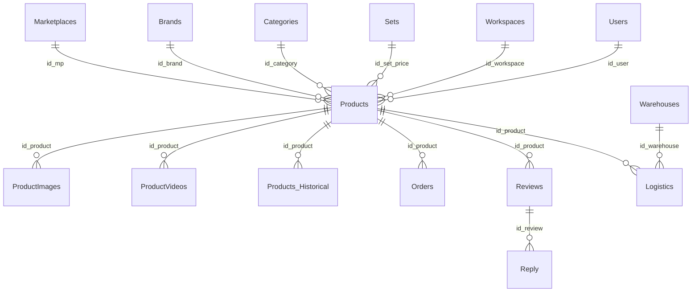
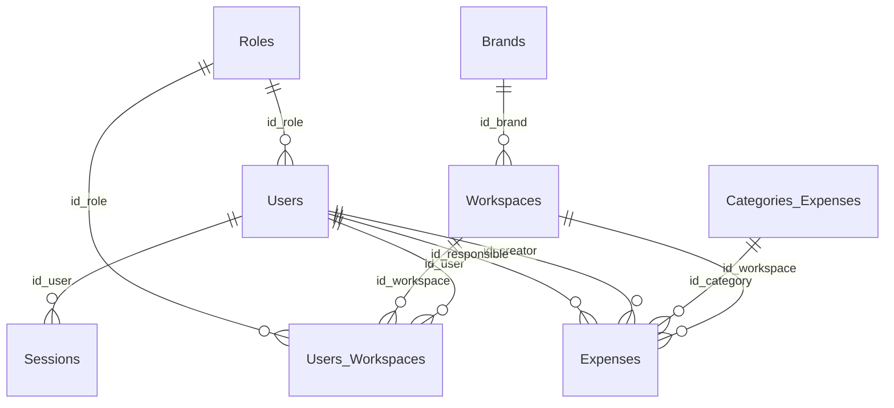
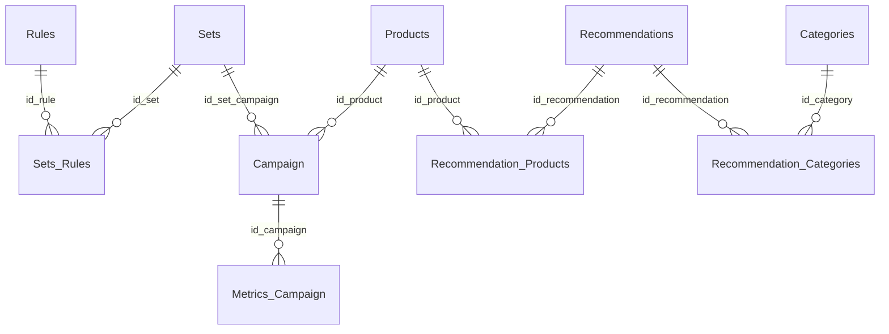

# AshmesMarketplaces Database Documentation

## Table of Contents

- [Current Status](#current-status)
- [Naming Conventions](#naming-conventions)
- [Type Conventions](#type-conventions)
- [DbContext DbSets](#dbcontext-dbsets)
- [Table Catalog](#table-catalog)
- [Relationships](#relationships)
- [Mermaid ER Diagrams](#mermaid-er-diagrams)
- [Runtime Database Setup](#runtime-database-setup)
- [Migration Strategy](#migration-strategy)

## Current Status

The database model is implemented as .NET Domain entities plus EF Core Fluent API configurations. The first migration exists: `20260518152454_InitialCreate`. PostgreSQL is the target database, and the Npgsql EF Core provider/runtime setup is configured.

`ApplicationDbContext` currently contains DbSets for all implemented entities, including the Recommendation block.

Runtime setup currently includes:

- `Npgsql.EntityFrameworkCore.PostgreSQL` in DataAccess;
- API `ApplicationDbContext` registration using `ConnectionStrings:Postgres`;
- `ApplicationDbContextFactory` for design-time EF tooling;
- local `dotnet-ef` tool manifest;
- local Docker Compose infrastructure for PostgreSQL, pgAdmin, Redis, and MinIO.

Runtime verification already completed once against local PostgreSQL:

- `InitialCreate` was applied with `dotnet ef database update`;
- `__EFMigrationsHistory` contained `20260518152454_InitialCreate`;
- generated schema was checked for tables, FK delete behavior, `jsonb`, and decimal precision.

Recent API coverage stages for Catalog, Product, and Operations did not change the database schema and did not require new migrations.

## Naming Conventions

| Item | Convention |
|---|---|
| Entity class | PascalCase singular, e.g. `Product`, `CampaignMetric` |
| Table | ER/project documentation name, e.g. `Products`, `Users_Workspaces` |
| Column | Explicit `snake_case` via `.HasColumnName(...)` |
| FK property | `Id<Entity>` or documented field name, e.g. `IdProduct`, `IdSetCampaign` |
| Join entity | Explicit class with composite key |
| Configuration | One `IEntityTypeConfiguration<T>` per entity |

## Type Conventions

| Logical type | .NET type | EF/PostgreSQL policy |
|---|---|---|
| GUID PK/FK | `Guid` or `ProductId` | `uuid` via Npgsql provider |
| Product ID | `ProductId` readonly value object | Value conversion to/from `Guid` |
| Money | `decimal` | `decimal(18,2)` |
| Score | `decimal` | `decimal(18,6)` |
| Counts | `int` | integer |
| External IDs/SKU | `string` | usually `varchar(128)` |
| Long text | `string` | `text` |
| JSON | `JsonDocument?` | `jsonb` |
| Documented enum without values | `int` | comment in entity |
| Date/time | `DateTime` / `DateTime?` | UTC-only, PostgreSQL `timestamptz` |

Identifier generation policy:

- Guid and `ProductId` primary keys are generated by application constructors/factories.
- EF configurations use `.ValueGeneratedNever()` for Guid/ProductId keys.
- `Session.Id` remains the documented integer identity exception.

## DbContext DbSets

Current DbSets:

```text
Products, ProductImages, ProductVideos, ProductHistories,
Orders, Reviews, ReviewReplies, Logistics,
Users, Sessions, Workspaces, UserWorkspaces,
Expenses, ExpenseCategories,
Campaigns, CampaignMetrics,
Recommendations, RecommendationProducts, RecommendationCategories,
Marketplaces, Brands, BrandMarketplaces, Categories, Warehouses,
Roles, Permissions, PermissionCategories, RolePermissions, RoleSubroles,
Rules, RuleSets, RuleSetRules
```

## Table Catalog

### Catalog and Marketplace

| Table | Entity | Purpose | Key columns and types | FKs / relationships |
|---|---|---|---|---|
| `Marketplaces` | `Marketplace` | External marketplace reference | `id Guid PK`, `name varchar(255)`, `api_url varchar(2048)`, `api_version varchar(128)`, `currency varchar(32)`, `region varchar(128)`, `type_commission int enum`, `scheme_delivery varchar(128)`, `date_update DateTime` | Referenced by `Products`, `Warehouses`, `Brands_Marketplaces` |
| `Brands` | `Brand` | Brand reference and marketplace-facing brand metrics | `id Guid PK`, `name varchar(255)`, `is_verified bool`, `country varchar(128)`, `manufacturer varchar(255)`, `sales_amount int`, `rate_redemption int`, `level int`, `type int enum`, `date_mp_registration DateTime`, `date_update DateTime` | Referenced by `Products`, `Workspaces`, `Brands_Marketplaces` |
| `Brands_Marketplaces` | `BrandMarketplace` | Brand-marketplace many-to-many with marketplace external ID | `id_mp Guid PK/FK`, `id_brand Guid PK/FK`, `id_on_mp varchar(128)` | FK to `Marketplaces` and `Brands`, delete restrict |
| `Categories` | `Category` | Marketplace/category hierarchy | `id Guid PK`, `id_parent_category Guid?`, `id_on_mp varchar(128)?`, `name varchar(255)`, `level int`, `is_active bool`, `date_update DateTime` | Self FK `id_parent_category`, referenced by `Products`, `Recommendation_Categories` |
| `Warehouses` | `Warehouse` | Marketplace warehouse reference | `id Guid PK`, `id_mp Guid FK`, `name varchar(255)`, `code varchar(128)`, `region varchar(128)`, `city varchar(128)?`, `address varchar(512)?`, `latitude varchar(64)?`, `longitude varchar(64)?`, `is_active bool`, `type int enum`, `date_create DateTime`, `date_update DateTime` | FK to `Marketplaces`, referenced by `Logistics` |

### Access Control

| Table | Entity | Purpose | Key columns and types | FKs / relationships |
|---|---|---|---|---|
| `Roles` | `Role` | Access role reference | `id Guid PK`, `name varchar(255)`, `description text?`, `date_create DateTime`, `date_update DateTime` | Referenced by `Users`, `Users_Workspaces`, role joins |
| `Permissions_Categories` | `PermissionCategory` | Permission grouping | `id Guid PK`, `name varchar(255)`, `description text?`, `date_update DateTime`, `date_create DateTime` | Referenced by `Permissions` |
| `Permissions` | `Permission` | Permission reference | `id Guid PK`, `id_category Guid FK`, `name varchar(255)`, `description text`, `domain int enum`, `date_create DateTime`, `date_update DateTime` | FK to `Permissions_Categories`, referenced by `Roles_Permissions` |
| `Roles_Permissions` | `RolePermission` | Role-permission many-to-many | `id_role Guid PK/FK`, `id_permission Guid PK/FK` | FK to `Roles`, `Permissions`, delete restrict |
| `Role_Subroles` | `RoleSubrole` | Role hierarchy join | `id_role Guid PK/FK`, `id_subrole Guid PK/FK` | Two FKs to `Roles`, delete restrict |

### Users, Workspaces, and Finance

| Table | Entity | Purpose | Key columns and types | FKs / relationships |
|---|---|---|---|---|
| `Users` | `User` | System user account | `id Guid PK`, `id_role Guid FK`, `login varchar(100)`, `password varchar(512)`, `email varchar(320)?`, `phone varchar(32)`, `status int enum`, `date_create DateTime`, `date_login DateTime` | FK to `Roles`, referenced by sessions, workspace joins, expenses |
| `Sessions` | `Session` | User sessions/tokens | `id int PK`, `id_user Guid FK`, `ip_address varchar(45)?`, `agent varchar(512)?`, `token varchar(2048)`, `status int enum`, `date_create DateTime`, `date_refreshed DateTime?`, `date_expires DateTime` | FK to `Users`, cascade |
| `Workspaces` | `Workspace` | Team/seller workspace | `id Guid PK`, `id_brand Guid? FK`, `name varchar(255)`, `description text?`, `url_invite varchar(2048)?`, `status int enum`, `date_create DateTime`, `date_update DateTime` | FK to `Brands`, referenced by users/products/expenses |
| `Users_Workspaces` | `UserWorkspace` | User-workspace membership with workspace role | `id_user Guid PK/FK`, `id_workspace Guid PK/FK`, `id_role Guid FK` | FK to `Users`, `Workspaces`, `Roles` |
| `Categories_Expenses` | `ExpenseCategory` | Expense category reference | `id Guid PK`, `name varchar(255)`, `description text?`, `date_create DateTime`, `date_update DateTime` | Referenced by `Expenses` |
| `Expenses` | `Expense` | Non-marketplace operational expenses | `id Guid PK`, `id_workspace Guid FK`, `id_category Guid? FK`, `id_creator Guid FK`, `id_responsible Guid? FK`, `name varchar(255)`, `description text?`, `cost decimal(18,2)?`, `status int enum`, `date_pay DateTime?`, `date_create DateTime`, `date_update DateTime` | FK to `Workspaces`, `Categories_Expenses`, `Users` as creator/responsible, delete restrict |

### Product Aggregate

| Table | Entity | Purpose | Key columns and types | FKs / relationships |
|---|---|---|---|---|
| `Products` | `Product` | Product aggregate root | `id ProductId/Guid PK`, `id_mp Guid FK`, `id_set_price Guid? FK`, `id_workspace Guid? FK`, `id_brand Guid? FK`, `id_user Guid? FK`, `id_category Guid? FK`, `id_on_mp varchar(128)?`, `sku_product varchar(128)?`, `sku_seller varchar(128)`, `name varchar(255)`, `description varchar(2000)?`, `characteristics jsonb?`, `barcode varchar(50)?`, `commission int?`, `status int`, `date_create DateTime?`, `date_update DateTime` | FK to `Marketplaces`, `Brands`, `Categories`, `Sets`, `Workspaces`, `Users`; aggregate root for product media |
| `ProductImages` | `ProductImage` | Product image records | `id Guid PK`, `id_product ProductId/Guid FK`, `url varchar(2048)`, `sort_order int`, `is_main bool` | FK to `Products`, cascade |
| `ProductVideos` | `ProductVideo` | Product video records | `id Guid PK`, `id_product ProductId/Guid FK`, `url varchar(2048)`, `sort_order int` | FK to `Products`, cascade |
| `Products_Historical` | `ProductHistory` | Historical product price/cost/activity state | `id Guid PK`, `id_product ProductId/Guid FK`, `cost decimal(18,2)?`, `price decimal(18,2)`, `discount int`, `is_active bool`, `is_auto_discount_active bool?`, `date DateTime` | FK to `Products`, delete restrict |

### Operations

| Table | Entity | Purpose | Key columns and types | FKs / relationships |
|---|---|---|---|---|
| `Orders` | `Order` | Product order facts | `id Guid PK`, `id_product ProductId/Guid FK`, `price decimal(18,2)`, `discount decimal(18,2)`, `amount int`, `location_source varchar(255)?`, `location_destination varchar(255)?`, `status int enum`, `date_delivered DateTime?`, `date_opened DateTime`, `date_closed DateTime?`, `date_update DateTime` | FK to `Products`, delete restrict |
| `Reviews` | `Review` | Product reviews | `id Guid PK`, `id_product ProductId/Guid FK`, `id_on_mp varchar(128)`, `rating int`, `text text?`, `is_replied bool`, `date_create DateTime`, `date_reply DateTime?` | FK to `Products`, delete restrict |
| `Reply` | `ReviewReply` | Seller reply to review | `id Guid PK`, `id_review Guid FK`, `id_on_mp varchar(128)`, `text text`, `status int enum`, `date_create DateTime`, `date_update DateTime` | FK to `Reviews`, delete restrict |
| `Logistics` | `Logistic` | Product stock/logistics facts | `id Guid PK`, `id_product ProductId/Guid FK`, `id_warehouse Guid? FK`, `stock_amount int?`, `stock_amount_statistic int`, `stock_in_transit int?`, `cost_storage decimal(18,2)?`, `cost_logistic decimal(18,2)?`, `type int enum`, `date DateTime` | FK to `Products` restrict, FK to `Warehouses` restrict |

### Rules, Advertising, and Recommendations

| Table | Entity | Purpose | Key columns and types | FKs / relationships |
|---|---|---|---|---|
| `Rules` | `Rule` | Formalized automation rule | `id Guid PK`, `name varchar(255)`, `description text?`, `code varchar(128)`, `number int?`, `domain int enum`, `date_create DateTime`, `date_update DateTime` | Referenced by `Sets_Rules` |
| `Sets` | `RuleSet` | Rule group/set | `id Guid PK`, `name varchar(255)`, `description text?`, `date_update DateTime`, `date_create DateTime` | Referenced by `Products`, `Campaign`, `Sets_Rules` |
| `Sets_Rules` | `RuleSetRule` | Set-rule many-to-many | `id_set Guid PK/FK`, `id_rule Guid PK/FK` | FK to `Sets`, `Rules`, delete restrict |
| `Campaign` | `Campaign` | Advertising campaign | `id Guid PK`, `id_product ProductId/Guid FK`, `id_set_campaign Guid? FK`, `name varchar(255)`, `budget decimal(18,2)?`, `region varchar(128)?`, `status int enum`, `type int enum`, `description text?`, `time_to_impression jsonb?`, `date_start DateTime?`, `date_end DateTime?`, `date_create DateTime`, `date_update DateTime` | FK to `Products` restrict, FK to `Sets` restrict |
| `Metrics_Campaign` | `CampaignMetric` | Campaign metrics by date | `id Guid PK`, `id_campaign Guid FK`, `impression_amount int?`, `clicks_amount int?`, `cost_day decimal(18,2)?`, `date DateTime` | FK to `Campaign`, delete restrict |
| `Recommendations` | `Recommendation` | ML/recommendation result | `id Guid PK`, `id_model Guid`, `type int enum`, `type_object int enum`, `score decimal(18,6)`, `explanation jsonb?`, `snapshot jsonb?`, `date_create DateTime`, `date_update DateTime` | Referenced by recommendation joins |
| `Recommendation_Products` | `RecommendationProduct` | Recommendation-product many-to-many | `id_recommendation Guid PK/FK`, `id_product ProductId/Guid PK/FK` | FK to `Recommendations` cascade, FK to `Products` restrict |
| `Recommendation_Categories` | `RecommendationCategory` | Recommendation-category many-to-many | `id_recommendation Guid PK/FK`, `id_category Guid PK/FK` | FK to `Recommendations`, `Categories`, cascade |

## Relationships

Delete behavior policy in the current model:

- Product media cascades from `Products`:
  - `ProductImages`;
  - `ProductVideos`.
- Analytical/history records restrict deletion:
  - product history;
  - orders;
  - reviews and replies;
  - logistics;
  - campaigns and campaign metrics;
  - recommendation-product links from `Products`.
- Operational cleanup cascades remain where data is not business history:
  - user sessions from `Users`;
  - user-workspace membership from `Users`/`Workspaces`;
  - recommendation-category links from `Recommendations`/`Categories`;
  - recommendation-product links from `Recommendations`.
- Reference/catalog relationships generally restrict deletion.

No unique indexes are configured beyond primary keys and composite primary keys.

## Mermaid ER Diagrams

### Product and Operations



### Access and Workspace



### Rules, Advertising, Recommendations



## Runtime Database Setup

Runtime setup exists, and `InitialCreate` has been created and verified.

Configured pieces:

- DataAccess package: `Npgsql.EntityFrameworkCore.PostgreSQL`.
- DataAccess design package: `Microsoft.EntityFrameworkCore.Design`.
- API design package: `Microsoft.EntityFrameworkCore.Design`.
- API DbContext registration via `ConnectionStrings:Postgres`.
- Design-time factory: `ApplicationDbContextFactory`.
- Local EF tool manifest: `.config/dotnet-tools.json`.
- Local infrastructure: `docker-compose.local.yml` plus `.env.example`.

Local infrastructure services:

- PostgreSQL on port `5432` by default.
- pgAdmin on port `5050` by default.
- Redis on port `6379` by default.
- MinIO API on port `9000` and console on port `9001` by default.

Typical local workflow:

```powershell
copy .env.example .env
docker compose -f docker-compose.local.yml --env-file .env up -d
dotnet tool restore
dotnet build E:\AshmesMarketplaces\Backend\AshmesMarketplaces.sln
dotnet ef dbcontext info --project Backend\AshmesMarketplaces.DataAccess\AshmesMarketplaces.DataAccess.csproj --startup-project Backend\AshmesMarketplaces.API\AshmesMarketplaces.API.csproj
```

Do not call `Database.Migrate()` on application startup. Migrations are applied manually after review.

## Migration Strategy

The first migration has already been created:

```text
Backend/AshmesMarketplaces.DataAccess/Migrations/20260518152454_InitialCreate.cs
Backend/AshmesMarketplaces.DataAccess/Migrations/20260518152454_InitialCreate.Designer.cs
Backend/AshmesMarketplaces.DataAccess/Migrations/ApplicationDbContextModelSnapshot.cs
```

Recommended future process:

1. Create future migrations only as dedicated reviewed tasks.
2. Inspect generated migration carefully before applying it.
3. Verify table names, FK delete behavior, `ProductId` conversion, `jsonb`, decimal precision, and `timestamptz`.
4. Apply migrations manually; do not auto-migrate on application startup.
5. Keep migrations small and tied to reviewed model changes.
